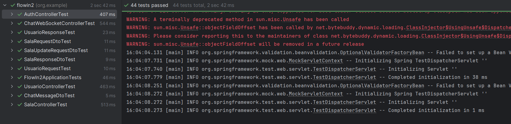

**Tu nueva red para compartir música en tiempo real**

> **CS2031 – Desarrollo Basado en Plataformas**

> **Integrantes**:  
> - Benites Camacho, Alonso Aarón
> - Ladron de Guevara Aguirre, Diego Abraham 
> - Janampa Salvatierra, Raúl

---
## 📑 Tabla de Contenidos

| Sección                         | Subsección                                                     |
|--------------------------------|----------------------------------------------------------------|
| 1. ❗ Identificación del Problema o Necesidad  | - Descripción del Problema<br>- Justificación                |
| 2. 💡 Descripción de la Solución              | - Funcionalidades Implementadas<br>- Tecnologías Utilizadas  |
| 3. 🗂️ Modelo de Entidades                      | - Diagrama<br>- Descripción de Entidades<br>- Relaciones                     |
| 4. 🧪 Testing y Manejo de Errores             | - Niveles de Testing Realizados<br>- Resultados<br>- Manejo de Errores |
| 5. 🔒 Medidas de Seguridad Implementadas      | - Seguridad de Datos<br>- Prevención de Vulnerabilidades      |
| 6. ⚡ Eventos y Asincronía                     | - Evento principal utilizado<br>- Listener asíncrono<br>- Configuración del ejecutor asíncrono<br>- Importancia de la asincronía |
| 7. 👾 GitHub                                 | - Uso de issues<br>- Deployment |
| 8. ✅ Conclusión                              | - Logros del Proyecto<br>- Aprendizajes Clave<br>- Trabajo Futuro |
| 9. 📎 Apéndices                              |                                                                |

---
## ❗ Identificación del Problema o Necesidad

### Descripción del Problema

En la actualidad, muchas plataformas de música carecen de una dimensión social activa. Los usuarios suelen escuchar música de forma individual, sin posibilidad de compartir en tiempo real con otros ni descubrir música de manera colaborativa.

### Justificación

Es importante ofrecer a los usuarios una experiencia musical más interactiva y comunitaria, donde compartir gustos, descubrir nueva música y conocer personas sea parte del valor agregado. FlowIn busca posicionarse como la solución que une streaming, redes sociales y escucha colectiva.

---
## 💡 Descripción de la Solución

### Funcionalidades Implementadas

- **Perfil de Usuario:** Visualización de gustos musicales, artistas favoritos y tipo de oyente.
- **Salas Virtuales:** Espacios para compartir música en tiempo real con otros usuarios.
- **Chats Temáticos:** Canales de conversación enfocados en géneros, artistas o exploración musical aleatoria.
- **Recomendaciones Inteligentes:** Sugerencias de usuarios, salas y música según preferencias.
- **Login y Configuración Inicial:** Registro y selección manual de gustos musicales.
- **Exploración de Salas:** Filtrado por género/artista o acceso aleatorio a salas activas.

### Tecnologías Utilizadas

- **Backend:** Spring Boot y Java.
- **Base de Datos:**  PostgreSQL.
- **Almacenamiento:** Servicio tipo S3 para música.
- **Comunicación en Tiempo Real:** WebSockets para chat y sincronización.
- **Despliegue:** Docker
- **Pruebas:** Mock tests, Testcontainers y pruebas de WebSocket mediante HTML.

---
## 🗂️ Modelo de Entidades

### Diagrama

> Agregamos aqui el driagrama

### Descripción de Entidades

- **Usuario**: ID, nombre, email, contraseña, gustos musicales, tipo de oyente, artistas favoritos.
- **Sala**: ID, nombre, categoría (género/artista), estado, usuarios activos, canciones compartidas.
- **ChatMessage**(Mensaje): Username, contenido y timestamp para representar mensajes dentro de una sala.

### Relaciones

- Un usuario puede estar conectado a una sala (`ManyToOne`) y puede ser host de una sala (`OneToOne`).
- Una sala puede tener muchos usuarios conectados (`OneToMany`).
- Una sala contiene múltiples mensajes de chat almacenados como colección embebida (`ElementCollection`).

---
## 🧪 Testing y Manejo de Errores

### Niveles de Testing Realizados
- Pruebas unitarias con mocks para controladores, validando códigos `HTTP` y `DTOs`.
- Pruebas de integración usando `Testcontainers` y `@SpringBootTest` para levantar un contenedor `PostgreSQL` en `Docker`.
- Pruebas funcionales de `WebSocket` mediante un cliente `HTML` para verificar la comunicación en tiempo real.

### Resultados
- Se completaron 44 pruebas en diferentes componentes del sistema. Al principio, tuvimos dificultades para validar el funcionamiento del `WebSocket`, pero logramos resolverlo implementando un test `HTML` desde el backend que confirmó su correcto desempeño. Además, detectamos que varios controladores devolvían códigos `HTTP` inconsistentes, por lo que se decidió estandarizar estos códigos para asegurar respuestas claras y confiables en toda la aplicación.


### Manejo de Errores
- Se implementó un manejador global de excepciones usando `@ControllerAdvice` para capturar errores comunes de forma centralizada. Se definieron excepciones personalizadas como `ResourceNotFoundException` y `ResourceConflictException`, que devuelven respuestas `HTTP` con códigos 404 y 409 respectivamente, junto con mensajes descriptivos. Esto permite manejar errores de manera consistente y brindar respuestas claras y apropiadas a los clientes, mejorando la robustez y mantenibilidad del sistema.
```java
@ControllerAdvice
public class GlobalExceptionHandler {

    @ExceptionHandler(ResourceNotFoundException.class)
    public ResponseEntity<String> handleResourceNotFoundException(ResourceNotFoundException e) {
        return ResponseEntity.status(HttpStatus.NOT_FOUND).body(e.getMessage());
    }

    @ExceptionHandler(ResourceConflictException.class)
    public ResponseEntity<String> handleResourceConflictException(ResourceConflictException e) {
        return ResponseEntity.status(HttpStatus.CONFLICT).body(e.getMessage());
    }
}
```

---
## 🔒 Medidas de Seguridad Implementadas

### Seguridad de datos

#### Autenticación basada en JWT (JSON Web Tokens): 
Se utiliza un filtro personalizado `JwtAuthenticationFilter` para validar tokens en cada petición, asegurando que solo usuarios autenticados accedan a los recursos protegidos.

```java
public class JwtAuthenticationFilter extends OncePerRequestFilter {
    // lógica para validar JWT y establecer contexto de seguridad
}
```

#### Cifrado de contraseñas:
Las contraseñas se almacenan cifradas con `BCryptPasswordEncoder`, evitando almacenar datos sensibles en texto plano.

```java
@Bean
public PasswordEncoder passwordEncoder() {
    return new BCryptPasswordEncoder();
}
```

#### Gestión de permisos y roles:
Se define una jerarquía de roles (`ADMIN > USER`) para controlar accesos usando anotaciones de seguridad y configuraciones en Spring Security.

```java
@Bean
static RoleHierarchy roleHierarchy() {
    RoleHierarchyImpl hierarchy = new RoleHierarchyImpl();
    hierarchy.setHierarchy("ADMIN > USER");
    return hierarchy;
}
```

#### Configuración de seguridad web:
Se deshabilita CSRF para facilitar el uso de tokens, se configuran rutas públicas y protegidas, y se maneja el estado de sesión como stateless para APIs REST.

```java
http.csrf(AbstractHttpConfigurer::disable)
    .authorizeHttpRequests(authorize -> 
        authorize.requestMatchers("/usuario/**", "/auth/**").permitAll()
                 .anyRequest().authenticated())
    .sessionManagement(manager -> manager.sessionCreationPolicy(SessionCreationPolicy.STATELESS));
```

Estas medidas permiten proteger la integridad y confidencialidad de la información manejada por la aplicación.

### Prevención de Vulnerabilidades

El método `findByUsername` en el `UsuarioRepository` está protegido automáticamente contra inyecciones SQL gracias a Spring Data JPA. Este método se convierte en una consulta parametrizada, lo que significa que los valores se tratan como datos y no como parte del código SQL, evitando ataques de inyección.

```java
public interface UsuarioRepository extends JpaRepository<Usuario,Long> {
    Optional<Usuario> findByUsername(String username);
}
```
Internamente, Spring Data JPA usa PreparedStatements que separan consulta y datos, evitando que el parámetro username manipule la consulta SQL y garantizando su seguridad.

---
## ⚡ Eventos y Asincronía
En FlowIn se utilizan eventos para manejar procesos que no requieren respuesta inmediata y que pueden ejecutarse en segundo plano, mejorando la performance y experiencia del usuario.

### Evento principal utilizado:

`UserRegisteredEvent`, que se dispara cuando un usuario se registra exitosamente.

### Listener asíncrono:

La clase `WelcomeEventListener`, escucha este evento y envía un correo de bienvenida sin bloquear el hilo principal, gracias a la anotación `@Async`.

```java
@Async("asyncExecutor")
@EventListener
public void handleUserRegisteredEvent(UserRegisteredEvent event) {
    emailService.sendWelcomeEmail(event.getEmail());
}
```

### Configuración del ejecutor asíncrono:

Se define un `TaskExecutor` simple para gestionar la ejecución paralela de tareas.

```java
@Bean(name = "asyncExecutor")
public TaskExecutor taskExecutor() {
    return new SimpleAsyncTaskExecutor();
}
```

### Importancia de la asincronía:

Ejecutar tareas como el envío de correos en segundo plano evita bloqueos en la respuesta al usuario, mejora la escalabilidad y reduce el tiempo de espera en operaciones críticas, ofreciendo una experiencia más fluida.

---
## 👾 GitHub

- Gracias a las herramientas de GitHub, mantuvimos el proyecto organizado mediante la creación de issues para reportar bugs o proponer nuevas funcionalidades. Para asegurar el seguimiento y asignación de tareas, usamos etiquetas y asignamos responsables. Además, utilizamos la funcionalidad `.Closes` en los pull requests para vincular automáticamente los issues resueltos, facilitando el control y cierre eficiente de las tareas.

---
## ✅ Conclusión

### 🎯 Logros del Proyecto:

Con este proyecto, hemos logrado desarrollar de manera independiente nuestro primer backend utilizando las herramientas y conocimientos adquiridos en el curso. Fue nuestra primera experiencia trabajando en equipo en un proyecto de esta magnitud, lo que nos permitió aprender no solo aspectos técnicos, sino también habilidades colaborativas, enfrentando y superando diversos retos.

Destacamos especialmente el aprendizaje profundo sobre tecnologías clave como WebSockets, cuya implementación, aunque desafiante, nos enriqueció y nos prepara para futuros desarrollos. Además, logramos completar exitosamente el despliegue (deployment) del proyecto, consolidando una experiencia integral desde el desarrollo hasta la puesta en producción.

En conjunto, estamos satisfechos con los resultados obtenidos, ya que el proyecto nos permitió no solo resolver una necesidad real, sino también fortalecer nuestras capacidades técnicas y de trabajo en equipo para futuros desafíos.

### 📚 Aprendizajes Clave:

Durante el desarrollo del proyecto, uno de los aprendizajes más significativos fue la implementación y manejo de WebSockets, que nos permitió comprender la importancia de la comunicación en tiempo real y su integración con una arquitectura basada en APIs REST. Esta experiencia nos enseñó cómo diseñar sistemas que combinan distintos tipos de comunicación para ofrecer una mejor experiencia al usuario.

Asimismo, el proceso de deployment nos brindó valiosas lecciones sobre la preparación y configuración del entorno de producción, así como la importancia de la automatización y la contenedorización con Docker para facilitar la escalabilidad y mantenimiento del proyecto.

Finalmente, trabajamos en mejorar la interacción entre los distintos componentes del backend, lo que reforzó nuestro entendimiento sobre la gestión eficiente de eventos asíncronos y la sincronización interna para optimizar el rendimiento y la respuesta del sistema.

### 🚀 Trabajo Futuro

Como mejoras futuras, contemplamos la implementación de salas gestionadas por un host basado en inteligencia artificial. Esto permitiría que, en caso de no existir una sala con los gustos musicales específicos de un usuario, una sala automatizada pueda generar una experiencia personalizada y continua.

Además, se planea optimizar el backend con nuevas funcionalidades que respondan de manera más eficiente a las diversas necesidades de los usuarios, garantizando así una plataforma más robusta y adaptable.

Otra posible extensión incluye la integración de cámaras en las salas virtuales, facilitando la interacción visual para grupos que deseen estudiar o compartir momentos mientras escuchan música, reduciendo la sensación de aislamiento y promoviendo una experiencia social más completa.

---
## 📎 Apéndices
- [WebSockets con Spring - Baeldung](https://www.baeldung.com/websockets-spring)
- [WebSocket Spring Boot: Build Real-Time Bidirectional Applications - Simform](https://medium.com/simform-engineering/websocket-spring-boot-build-a-real-time-bidirectional-applications-e8c95bc19cbf)
- [YouTube: Real-Time Applications with WebSockets Tutorial](https://www.youtube.com/watch?v=KAm6I_iLXOI)
- [Building Real-Time Applications: A Comprehensive Guide - Medium](https://medium.com/astute-info-solution/building-real-time-applications-a-comprehensive-guide-7e600d77c7ac)
